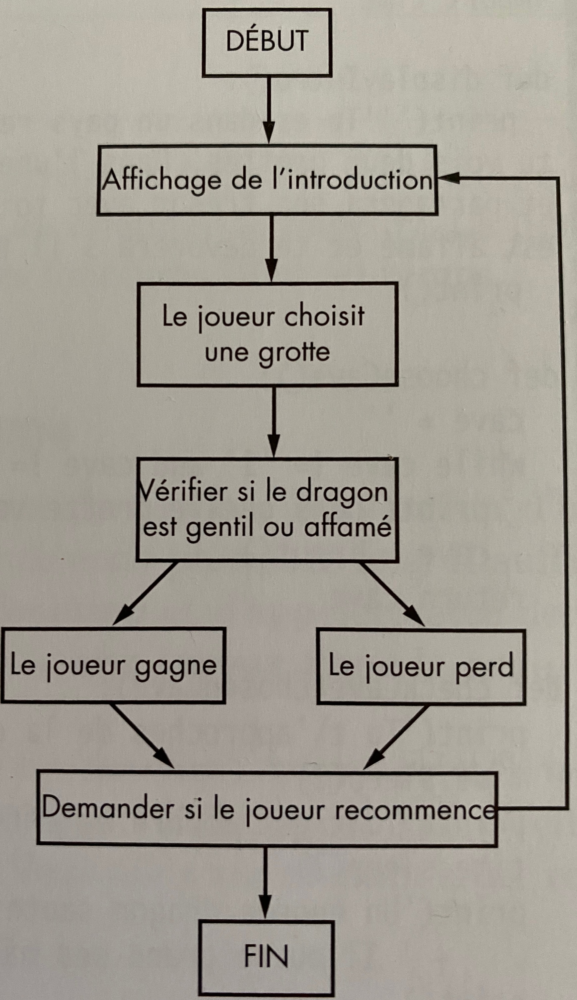

# L'antre du dragon

Dans ce jeu, l'utilisateur est plongé dans un pays rempli de dragons. Il se retrouve
devant deux grottes et doit choisir dans laquelle entrer ; L'une contient
un dragon amical prêt à partager son trésor, l'autre un dragon affamé cherchant
à dévorer les aventuriers.

## Sujets traités dans ce projet

  - Organigramme de programmation
  - Créer ses propres fonctions à l'aide du mot-clé DEF
  - Chaîne de caractères sur plusieurs lignes
  - Instruction WHILE
  - Les opérateurs booléens AND, OR, et NOT
  - Le mot-clé RETURN
  - Gérer les variables locales et globales
  - Paramètres et arguments
  - La fonction SLEEP()

Concevoir le programme via un organigramme. Ce dernier permet de prendre en compte toutes les actions possibles dans le jeu et de prévoir ce qui doit en découler.
Pour voir ce qui se passe dans le jeu, mettez votre doigt sur DEBUT puis suivez les flèches d'un cadre à l'autre.
Votre doigt représente l'exécution du programme. Le jeu prend fin lorsqu'il atteint la case FIN.
